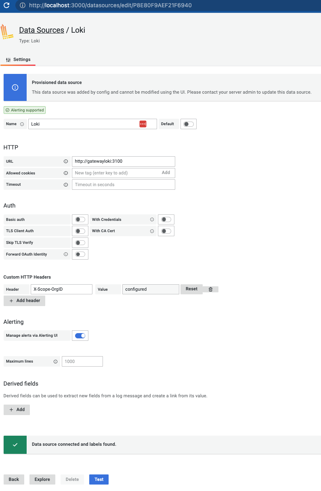
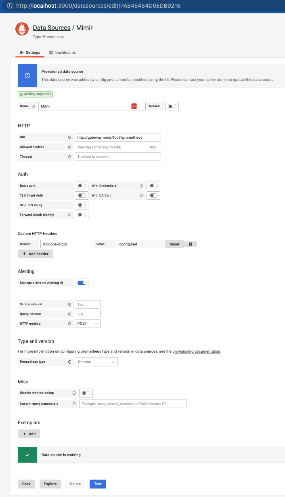
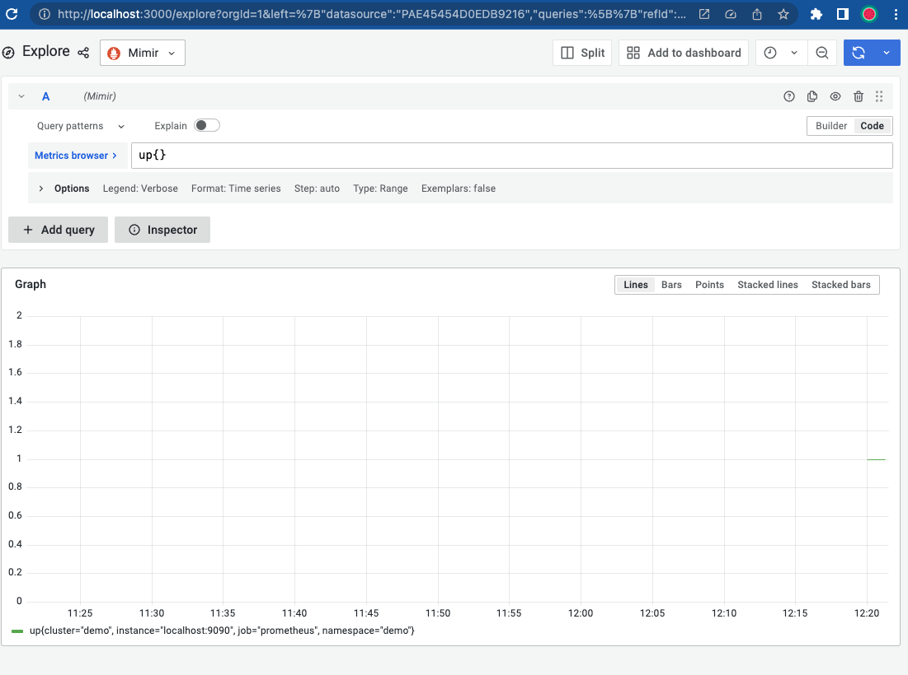
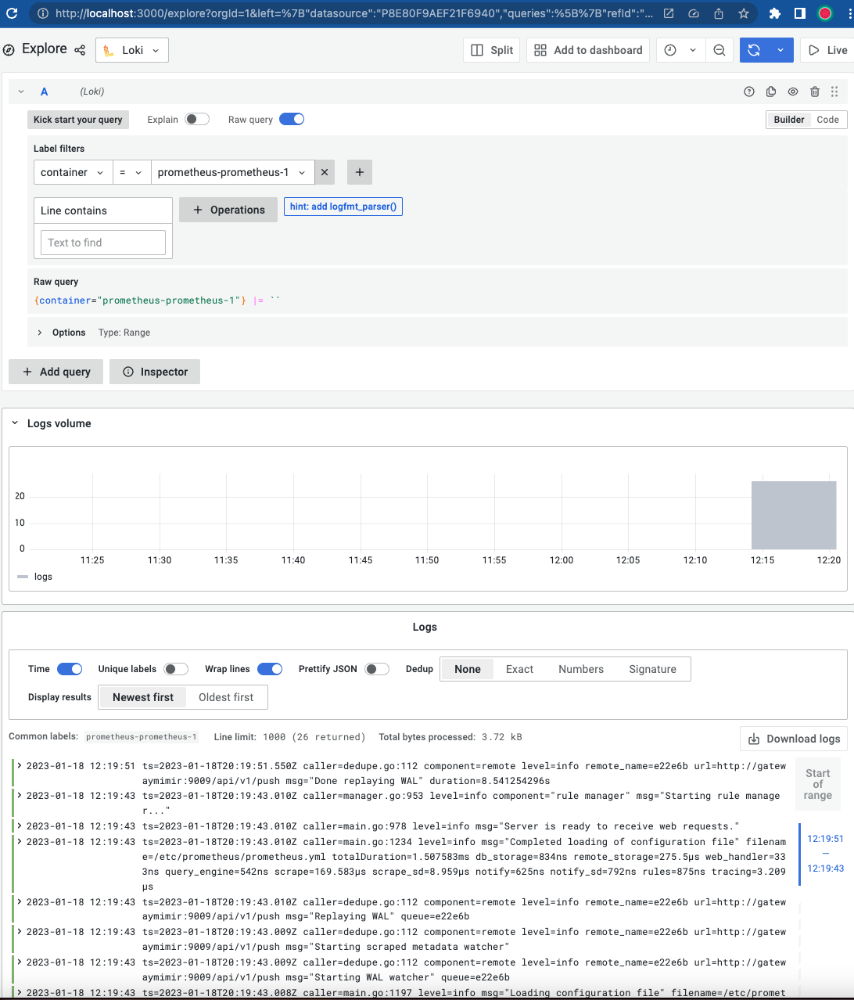

# Monitoring Demo

Get a monitoring station up and available. Seperated out into their own docker compose services that can be scaled up with the --scale feature. Allow anyone to have a monitoring setup locally and configured in a manner that an operations team can handle.

# Two options to run

## All services

Follow instructions in the allservices directory to get a simple turn key solution on your machine

## Separated

Follow the instructions to get a little more grandular and a structure where you can deploy in Cloud services with the ability to scale up and down

## Recommendation once everything is up

Checkout grafana explore at http://localhost:3000/explore

You will be able to query prometheus output through the Loki datasource for logs & Mimir for metrics 

## Services:

* Loki:       http://localhost:3100
* Promtail    http://localhost:9800
* Mimir:      http://localhost:9009
* Prometheus: http://localhost:9090
* Grafana:    http://localhost:3000

## Data source Screenshots to check to make sure things are working on Grafana:

### Data transfer through tenant with Prometheus and Promtail

Our backend services use Tenant IDs through the header `X-Scope-OrgID`. Prometheus sends it's metrics through it's config file with `mimirlocal` & Promtail sends it's logs with `lokilocal`. Grafana is configured to use these. Use proper organization structure to keep environments clean by using these tenant IDs 

### Secrets you need to be aware about

Inside loki and mimir, they both use S3 storage points with an `access_key_id` and `secret_access_key` with access their own "S3" bucket. Be sure to handle these parts properly with cloud deployment structure and secret management

## Benefits and what you can accomplish with this demo as a starting point

* Logs will be captured from the promtail config file to loki
* Metrics are captured through prometheus and sent to mimir
* Grafana has both data sources defined when brought up, you can start adjusting your prometheus config and promtail config to add in your other 
* All services are scalable because they are defined using gRPC communcation to talk with each other.
* There are load balancers in front of both backends so you can get to them on your browser
* Both Mimir and Loki use a service called minio to simulate an S3 like backend, it's intended that all provisioned storage is through that type of service that is flushed with loki and mimir over time. 
* When you want to deploy to a cloud service, you already have a built in scaling by component for both Mimir and Loki 

### Clean up jobs

All the data should be saved in .data/ for mimir and loki. That data doesn't not actually get saved until you flush either backend to be saved

#### Docker parts

* Clean up containers: `docker ps -qa | xargs docker rm`
* Clean up images: `docker images -q | xargs docker rmi`
* Clean up networks: `docker network prune` 
* Force destroy **all** docker components: `docker system prune --all --force --volumes` 

### Footnotes and references

I feel like people are intimidated with Kubernetes and the high requirements of other services. I wanted to get something approachable that includes sample applications like a node service, a python app or something along those lines. I will be including cadvisor and sample applications to showcase everything

This was inspired by a few tutorials and demos. 

* Play with Mimir: https://grafana.com/tutorials/play-with-grafana-mimir/
* Loki getting started: https://github.com/grafana/loki/tree/main/examples/getting-started
* New in Grafana Loki 2.4 https://www.youtube.com/watch?v=M8nYWBpbwWg 
* Ward Bekker's gist: https://gist.github.com/wardbekker/6abde118f530a725e60acb5adb04508a
* Getting started with Grafana Mimir: https://www.youtube.com/watch?v=pTkeucnnoJg  
